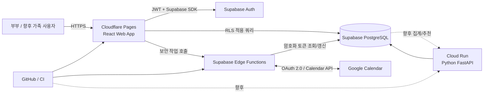

# 우리집 웹사이트 프로젝트 수행 계획서

> 작성 기준일: 2026-08-23  
> 대상 사용자: 초기 2명(부부), 향후 가족·그룹 단위 확장  
> 핵심 원칙: 초기 월 고정비 0원, 금융성 데이터의 사용자 간 격리, PostgreSQL 기반 확장성

## 1. 제안 요약

초기 권장 구성은 다음과 같다.

- 프런트엔드: React + TypeScript + Vite, Cloudflare Pages
- 데이터베이스·로그인: Supabase Free(PostgreSQL + Auth + Row Level Security)
- 초기 서버 로직: Supabase Edge Functions
- 향후 분석 서버: Python FastAPI + Google Cloud Run(필요할 때만 추가)
- 외부 연동: Google Calendar API + 사용자별 OAuth 2.0
- 개발·배포: GitHub + GitHub Actions 또는 Cloudflare/Supabase의 Git 연동

핵심 판단은 **Python 서버를 처음부터 상시 운영하지 않는 것**이다. 일정, 가계부, 디데이, 목표의 기본 CRUD는 Supabase가 직접 처리하고, Google OAuth 토큰처럼 브라우저에 노출하면 안 되는 작업만 서버리스 함수에 둔다. 월간 소비 분석과 비용 제안이 복잡해지는 시점에 FastAPI를 별도 서비스로 추가한다.

현재 Supabase Free는 프로젝트당 500MB DB, 월간 활성 사용자 50,000명, 1GB 파일 저장소와 월 500,000회 Edge Function 호출을 제공한다. 단, 1주간 비활성인 무료 프로젝트는 일시 중지되고 무료 프로젝트에는 자동 백업이 없으므로 정기 논리 백업이 필요하다. 공식 가격표: <https://supabase.com/pricing>

## 2. 목표와 범위

### 2.1 목표

1. 부부가 하나의 가정 공간에서 일정, 가계, 디데이, 목표를 함께 관리한다.
2. 개인 데이터와 가족 공유 데이터의 공개 범위를 명확히 구분한다.
3. 인프라 고정비 없이 시작하되, 데이터 증가·사용자 증가·분석 기능 추가에 대응한다.
4. 가계부 데이터를 처음부터 분석 가능한 구조로 축적한다.
5. 특정 BaaS에 과도하게 종속되지 않도록 표준 PostgreSQL과 독립된 도메인 모델을 사용한다.

### 2.2 MVP 포함 범위

- 이메일 또는 Google 로그인
- 가정(household) 생성, 초대, 구성원 역할 관리
- 일정 생성·조회·수정·삭제 및 Google Calendar 연동
- 수입·지출·이체 기록, 카테고리, 결제수단, 월별 예산
- 디데이 생성, 반복 설정, 남은 일수 표시
- 목표 생성, 진행률, 마감일, 상태 관리
- 홈 대시보드: 오늘 일정, 가까운 디데이, 이번 달 지출, 진행 중 목표
- 모바일 우선 반응형 UI
- 데이터 내보내기(CSV) 및 관리자용 백업 절차

### 2.3 MVP 제외 범위

- 은행·카드사 자동 수집
- 영수증 OCR
- 사진 및 대용량 파일 공유
- AI 기반 지출 추천
- 푸시 알림 앱, 네이티브 모바일 앱
- 복식부기 수준의 회계 기능

위 항목은 데이터 모델의 확장 지점은 마련하되 MVP 일정에는 넣지 않는다.

## 3. 권장 기술 구성

| 영역 | MVP 권장안 | 선택 이유 | 확장 시 전환/추가 |
|---|---|---|---|
| 웹 UI | React, TypeScript, Vite | 가볍고 정적 배포가 쉬움 | SEO나 서버 렌더링이 필요하면 Next.js 검토 |
| UI 도구 | Tailwind CSS, shadcn/ui | 빠른 반응형 개발과 일관된 컴포넌트 | 자체 디자인 시스템 |
| 상태·데이터 | TanStack Query, React Hook Form, Zod | 캐시·폼·검증 역할 분리 | 필요 시 전역 상태 도구 추가 |
| DB | Supabase PostgreSQL | 관계형 가계 데이터, SQL 분석, 이식성 | Supabase Pro 또는 관리형 PostgreSQL |
| 인증 | Supabase Auth | 이메일·Google 로그인과 DB 권한 연계 | 기업용 인증이 필요할 때 별도 IdP |
| 권한 | PostgreSQL RLS | 브라우저 직접 접근에도 행 단위 격리 | 조직·역할 정책 확장 |
| 서버 로직 | Supabase Edge Functions | 서버 고정비 없이 비밀키 처리 | Python FastAPI 서비스 추가 |
| Python 분석 | FastAPI, SQLAlchemy, Polars/Pandas | 예측·집계·추천 구현에 적합 | 비동기 작업 큐와 모델 서비스 |
| Python 배포 | Google Cloud Run | 컨테이너, 요청 기반 과금, scale-to-zero | 트래픽 증가 시 최소 인스턴스/다른 플랫폼 |
| 정적 호스팅 | Cloudflare Pages | Git 기반 배포와 무료 정적 호스팅 | 유료 플랜 또는 동일 구조 유지 |
| 테스트 | Vitest, Playwright, Pytest | 단위·통합·E2E 분리 | CI 병렬화 |

Cloud Run 무료 구간은 리전과 과금 방식에 따라 적용되며, 무료 구간 초과나 네트워크 전송에는 비용이 생길 수 있다. 결제 계정 및 예산 알림 설정이 필요하다. 공식 가격: <https://cloud.google.com/run/pricing>

## 4. 인프라 구성

### 4.1 환경 분리

- 로컬: Supabase CLI 로컬 스택 또는 별도의 개발 프로젝트
- 운영: Supabase Free 운영 프로젝트 + Cloudflare Pages 운영 배포
- 미리보기: Pull Request별 프런트엔드 Preview 배포
- 무료 프로젝트 2개 한도를 활용할 경우 `development`, `production`으로 구분

운영 DB에 직접 스키마를 수정하지 않고 모든 변경을 SQL migration으로 관리한다. 배포 순서는 DB migration → 서버리스 함수 → 웹 앱으로 고정한다.

### 4.2 비용 통제

- MVP 예상 고정비: 월 0원(무료 한도 내)
- 선택 비용: 개인 도메인 등록비
- Supabase 사용량 알림과 DB 크기 점검
- Google Cloud를 도입할 때 Budget Alert를 낮은 금액으로 설정하고 최소 인스턴스는 0으로 유지
- 예상치 못한 외부 API 반복 호출을 막기 위해 사용자별 rate limit, 캐시, 지수 백오프 적용
- 유료 전환은 사용량 임계치 또는 운영 안정성 요구가 발생했을 때 명시적으로 승인

주의: 무료 티어는 영구 보장이나 SLA가 아니다. 가격과 한도는 배포 전 다시 확인한다.

## 5. 계정·가정 단위 권한 설계

사용자 ID를 모든 업무 테이블에 직접 박아 넣는 단순 구조 대신 `household`를 최상위 경계로 둔다.

### 5.1 역할

- `owner`: 가정 삭제, 구성원·역할·연동 관리
- `admin`: 구성원 초대, 공용 설정 관리
- `member`: 공유 데이터 생성·수정
- `viewer`: 조회만 가능(향후 부모님·자녀 계정 등에 활용)

초기에는 부부 모두 `owner` 또는 한 명은 `owner`, 한 명은 `admin`으로 설정할 수 있다.

### 5.2 공개 범위

각 일정·목표에는 다음 범위를 지원한다.

- `household`: 가정 구성원 전체 공유
- `private`: 작성자만 접근
- `selected_members`: 선택한 구성원만 접근(2차 단계)

가계 거래는 기본적으로 `household` 공유로 하되, 개인 용돈 계정 등은 특정 사용자 소유 계정으로 분리할 수 있게 설계한다.

### 5.3 보안 원칙

- 모든 업무 테이블에 RLS를 활성화한다.
- 클라이언트에는 Supabase `anon` 공개 키만 둔다.
- `service_role` 키, Google client secret, OAuth refresh token은 브라우저에 절대 전달하지 않는다.
- RLS 정책은 `현재 사용자가 해당 household의 활성 구성원인가`를 공통 조건으로 사용한다.
- OAuth 토큰은 서버 전용 테이블에 암호화 저장하고, 토큰 원문은 로그에 남기지 않는다.
- 금융성 데이터 변경에는 `created_by`, `updated_by`, `created_at`, `updated_at`을 기록한다.
- 거래 삭제는 초기에는 soft delete 또는 audit log를 적용해 실수 복구가 가능하게 한다.

## 6. 데이터 모델 초안

### 6.1 공통·계정

| 테이블 | 주요 필드 | 용도 |
|---|---|---|
| `profiles` | `user_id`, `display_name`, `timezone`, `locale` | 인증 사용자 부가 정보 |
| `households` | `id`, `name`, `currency`, `timezone` | 데이터 격리의 최상위 단위 |
| `household_members` | `household_id`, `user_id`, `role`, `status` | 다대다 구성원·권한 |
| `invitations` | `household_id`, `email`, `role`, `expires_at` | 초대 흐름 |

모든 시간은 DB에 UTC로 저장하고 UI에서 `Asia/Seoul`로 표시한다. 날짜 자체가 의미인 디데이·회계일은 `date` 타입으로 별도 저장한다.

### 6.2 일정·캘린더 연동

| 테이블 | 주요 필드 | 용도 |
|---|---|---|
| `calendar_connections` | `user_id`, `provider`, `provider_account_id`, `status` | 사용자별 Google 연결 |
| `calendar_tokens` | `connection_id`, 암호화 토큰, `expires_at` | 서버 전용 OAuth 자격 증명 |
| `calendars` | `household_id`, `provider_calendar_id`, `sync_mode` | 로컬/외부 캘린더 |
| `events` | `calendar_id`, `title`, 시작·종료, `visibility`, `external_event_id` | 일정 본문 |
| `calendar_sync_state` | `calendar_id`, `sync_token`, `last_synced_at` | 증분 동기화 상태 |

일정은 처음부터 완전한 양방향 동기화를 만들기보다 아래 순서로 구현한다.

1. 사용자가 Google 계정을 연결한다.
2. 연동할 Google Calendar를 명시적으로 선택한다.
3. 1차: Google → 우리집 사이트 읽기 동기화
4. 2차: 사이트에서 생성한 일정 → 선택한 Google Calendar 쓰기
5. 3차: 변경 충돌 정책과 push notification 기반 양방향 증분 동기화

충돌은 `외부에서 수정된 시각`과 `로컬에서 수정된 시각`을 비교하되, 자동 덮어쓰기 전에 충돌 상태를 보존한다. 반복 일정은 Google의 recurrence 식을 원문 보존하고 화면 표시용으로 해석한다.

Google Calendar API는 2026-05-01 이후 새 프로젝트에 새 쿼터 체계가 적용된다. 현재 공식 문서상 표준 사용은 프로젝트당 분당 10,000회, 사용자·프로젝트당 분당 600회, 일 1,000,000회 미만이며, 2026년 후반 유료 초과 사용 도입이 예고되어 있다. 이 가족 규모에는 충분하지만 polling 대신 증분 동기화와 push notification을 사용한다. 공식 문서: <https://developers.google.com/workspace/calendar/api/guides/quota>

### 6.3 가계부

| 테이블 | 주요 필드 | 용도 |
|---|---|---|
| `financial_accounts` | `household_id`, `type`, `owner_user_id`, `opening_balance` | 현금·은행·카드·가상 계정 |
| `categories` | `household_id`, `type`, `parent_id`, `name` | 수입·지출 계층 카테고리 |
| `transactions` | `account_id`, `type`, `amount`, `occurred_on`, `category_id`, `merchant`, `memo` | 원장 역할의 핵심 거래 |
| `transaction_splits` | `transaction_id`, `category_id`, `amount` | 한 거래의 다중 카테고리 분할 |
| `transfers` | `from_transaction_id`, `to_transaction_id` | 계좌 간 이체의 양쪽 거래 연결 |
| `budgets` | `household_id`, `period`, `category_id`, `amount` | 월별 카테고리 예산 |
| `recurring_rules` | 주기, 다음 예정일, 기본 거래 값 | 월세·구독 등 반복 예정 거래 |
| `transaction_tags` | `transaction_id`, `tag_id` | 여행·육아 등 다차원 분석 |

금액은 부동소수점이 아닌 `numeric` 또는 최소 통화 단위 정수로 저장한다. 통화 코드도 저장해 향후 다중 통화를 지원한다. 통계 화면 성능이 필요해지면 원본 거래를 유지한 채 월별 materialized view 또는 집계 테이블을 추가한다.

### 6.4 디데이·목표

| 테이블 | 주요 필드 | 용도 |
|---|---|---|
| `ddays` | `household_id`, `title`, `target_date`, `counting_rule`, `recurrence` | 디데이·기념일 |
| `goals` | `household_id`, `title`, `metric_type`, `target_value`, `due_date`, `status` | 정량·체크형 목표 |
| `goal_members` | `goal_id`, `user_id`, `role` | 공동/개인 목표 |
| `goal_progress` | `goal_id`, `value`, `recorded_at`, `note` | 진행 이력 |
| `activity_logs` | 대상 종류·ID, 사용자, 변경 내용, 시각 | 중요 변경 감사 및 활동 피드 |

## 7. 기능별 요구사항과 완료 기준

### 7.1 인증·가정 관리

- 가입 후 가정 생성 또는 초대 수락 가능
- 탈퇴·구성원 제거 시 데이터 소유권 정책 명확화
- 다른 household의 ID를 URL/API에 넣어도 조회·수정 불가
- 초대 토큰은 만료 및 1회 사용 처리

### 7.2 일정

- 월·주·목록 보기
- 종일/시간 일정, 반복 일정, 개인/공유 범위
- Google 연결 해제 시 로컬 데이터 보존 정책 선택 가능
- 중복 생성 방지를 위한 `external_event_id` 유일성 보장
- 연동 실패와 마지막 성공 시각을 사용자에게 표시

### 7.3 가계부

- 수입·지출·이체를 구분하고 수정 이력 추적
- 기간·계정·카테고리·사용자별 필터
- 월 합계와 예산 대비 사용률 표시
- CSV 내보내기와 가져오기 전 미리보기/중복 검사
- 삭제·수정 뒤 잔액 및 대시보드 수치가 일치

### 7.4 디데이·목표

- D-day와 시작일 포함 여부 등 계산 규칙 명시
- 매년 반복 기념일 지원
- 목표 진행률 자동 계산과 수동 기록
- 마감 임박·달성 상태가 홈 화면에 반영

## 8. 가계부 고도화 로드맵

### 단계 A: 정확한 원장

- 수동 입력, CSV 가져오기, 카테고리 규칙
- 거래 중복 탐지용 `source`, `external_id`, 해시 필드
- 예산과 월간 요약

### 단계 B: 대시보드

- 월별 수입/지출 추이
- 고정비/변동비, 카테고리 비중, 예산 대비 실적
- 전월·최근 3개월·최근 12개월 비교
- SQL view 또는 materialized view로 집계 계층 분리

### 단계 C: 자동화

- 반복 거래 자동 제안
- 카드 명세서/은행 CSV 매핑 템플릿
- 상호명 정규화와 카테고리 자동 분류
- 작업이 길어지면 비동기 job 테이블과 worker 도입

### 단계 D: 월간 비용 제안

- 최소 3~6개월의 정제된 거래 데이터 확보 후 시작
- 먼저 규칙 기반: 예산 초과, 구독 증가, 이상 지출, 전월 대비 급증
- 이후 통계/ML: 계절성, 반복 패턴, 사용자 승인 이력 기반 개인화
- 제안에는 근거 거래·비교 기간·예상 절감액을 함께 표시
- 추천은 자동 실행하지 않고 사용자가 수락/거절하도록 설계

이 단계에서 Python FastAPI 서비스를 추가한다. API는 원본 전체를 무제한 조회하지 않고 household 권한이 확인된 집계 요청만 수행한다. 분석 결과는 `insights`, `recommendations`, `recommendation_feedback` 테이블에 버전과 근거를 함께 저장한다.

## 9. 수행 단계와 일정

1인 개발을 가정한 현실적인 MVP는 약 8주이며, 주당 가용 시간에 따라 조정한다.

| 단계 | 기간 | 주요 작업 | 산출물/종료 조건 |
|---|---:|---|---|
| 0. 발견·설계 | 1주 | 화면 흐름, 용어, 공개 범위, 카테고리 합의 | 와이어프레임, ERD, MVP 백로그 |
| 1. 기반 구축 | 1주 | 저장소, React, Supabase, migration, CI, 환경 분리 | 로그인과 자동 배포 성공 |
| 2. 계정·권한 | 1주 | 가정, 초대, 역할, RLS | 2계정 격리·공유 테스트 통과 |
| 3. 가계부 | 2주 | 계정, 거래, 카테고리, 예산, 월 요약 | 월 합계·이체·필터 검증 |
| 4. 일정·연동 | 1.5주 | 일정 UI, Google OAuth, 1차 동기화 | 선택 캘린더 동기화 성공 |
| 5. 디데이·목표 | 0.5주 | D-day, 목표, 진행률 | 홈 요약 연동 |
| 6. 안정화·출시 | 1주 | E2E, 보안, 백업·복구, 모바일 QA | 출시 체크리스트 통과 |

### MVP 이후 우선순위

1. 양방향 Calendar 증분 동기화와 충돌 처리
2. CSV 가져오기·카테고리 자동 규칙
3. 가계 대시보드 확장
4. PWA 설치와 알림
5. Python 분석 서비스 및 월간 제안

## 10. 테스트·품질 계획

- 단위 테스트: D-day 계산, 금액 합계, 이체, 예산 사용률, 반복 규칙
- DB 테스트: RLS 정책, constraint, migration 전후 데이터 보존
- 통합 테스트: Google 토큰 갱신, 증분 동기화, 중복 방지
- E2E: 가입 → 가정 초대 → 거래 입력 → 공유 확인 → 일정 연동
- 권한 테스트: 임의 household ID 접근, 만료 초대, 탈퇴 사용자 접근
- 모바일 QA: 작은 화면 입력, 날짜/금액 키보드, 느린 네트워크
- 접근성: 키보드 탐색, 레이블, 색상 외 상태 표시

출시 전 반드시 두 개의 서로 다른 테스트 계정과 두 개의 household를 만들어 교차 접근이 차단되는지 자동 테스트한다.

## 11. 운영·백업·관측성

### 11.1 백업

- Supabase Free에는 자동 백업이 포함되지 않으므로 주 1회 `pg_dump` 또는 제공되는 백업 방식으로 암호화 백업
- 월 1회 복구 리허설
- CSV 사용자 내보내기는 백업의 대체가 아닌 편의 기능으로 구분
- 백업 보관 위치와 보존 기간을 문서화하고 접근 권한 최소화

### 11.2 로그와 알림

- 인증 실패, OAuth 갱신 실패, 동기화 지연, 함수 오류를 구조화 로그로 기록
- 금액·메모·토큰 같은 민감정보는 로그에서 마스킹
- 무료 로그 보존이 짧으므로 중요한 작업 상태는 DB의 job/audit 테이블에 기록
- `/health` 또는 상태 화면에 마지막 캘린더 동기화 성공 시각 노출

### 11.3 장애 대응

- Calendar 장애 시 로컬 기능은 계속 사용 가능하도록 결합도를 낮춤
- 동기화 작업은 idempotency key와 재시도 횟수를 가짐
- 무료 DB 일시 중지 가능성을 사용자 친화적 오류로 처리
- 장애 복구 순서: 읽기 전용 전환 → 원인 확인 → 백업 확인 → migration/설정 롤백

## 12. 주요 위험과 대응

| 위험 | 영향 | 대응 |
|---|---|---|
| Supabase 무료 프로젝트 일시 중지 | 첫 접속 지연/일시 사용 불가 | 정기 사용, 운영 시 Pro 전환 기준 수립 |
| 무료 DB 자동 백업 없음 | 데이터 유실 | 외부 암호화 dump와 복구 훈련 |
| Google OAuth·검증 복잡성 | 연동 출시 지연 | 초기 앱 사용자를 테스트 사용자로 제한, 최소 scope 사용 |
| 양방향 일정 충돌 | 중복·덮어쓰기 | 단계적 연동, 외부 ID·수정시각·충돌 상태 보존 |
| RLS 정책 오류 | 가족 간 정보 노출 | DB 권한 자동 테스트와 service key 사용 최소화 |
| 가계부 모델 단순화 | 고도화 시 migration 비용 | 계정·거래·분할·이체를 초기부터 분리 |
| 무료 티어/가격 변경 | 예기치 않은 비용 | 월간 한도 점검, 예산 알림, 표준 PostgreSQL 유지 |
| 추천 품질 부족 | 신뢰 저하 | 규칙 기반부터 시작, 근거 표시, 피드백 저장 |

## 13. 유료 전환 기준

아래 중 하나가 발생하면 무료 운영을 고집하지 않고 전환을 검토한다.

- 무료 프로젝트 일시 중지가 생활 서비스 신뢰성을 해침
- DB 500MB의 70% 이상 사용
- 정기 백업·로그·장애 대응에 드는 운영 시간이 유료 요금보다 커짐
- 외부 공개로 사용자 수가 늘고 SLA가 필요함
- Edge Function 또는 API 호출량이 무료 한도에 근접
- Python 분석 작업이 요청 시간 내 끝나지 않아 비동기 컴퓨팅이 필요함

첫 유료 후보는 Supabase Pro(현재 공식 표기 월 $25부터)이며, Python은 Cloud Run 사용량 기반 비용을 별도로 관리한다. 실제 결제 직전에는 가격과 환율, 세금을 다시 확인한다.

## 14. 대안 비교

### 대안 1: Python 중심으로 처음부터 구축

`React + FastAPI + SQLAlchemy + Supabase PostgreSQL + Cloud Run` 구성이다.

- 장점: Python 단일 백엔드 규칙, 테스트 용이, 향후 분석 코드 재사용
- 단점: 초기 인증·배포·보안·운영 복잡도가 증가하고 Cloud Run 결제 계정 관리가 필요
- 선택 시점: Python 숙련도가 매우 높고 처음부터 복잡한 서버 규칙이 많은 경우

### 대안 2: Firebase 중심

- 장점: Google 생태계, Auth와 서버리스 통합
- 단점: 가계부의 관계·집계·SQL 분석에는 PostgreSQL보다 모델링이 불편할 수 있음
- 결론: 실시간 채팅·문서 중심이라면 좋지만 이 프로젝트의 1순위는 아님

### 대안 3: Django 단일 애플리케이션

`Django + PostgreSQL + HTMX 또는 React` 구성이다.

- 장점: 관리자 화면, ORM, 인증, 서버 중심 업무 규칙에 강함
- 단점: 항상 무료인 안정적 Python 호스팅 선택지가 제한적이고 서버 운영 면적이 커짐
- 선택 시점: 자체 관리 화면과 복잡한 백오피스가 핵심이 되는 경우

### 최종 권고

MVP는 **React/TypeScript + Supabase + Edge Functions**로 만들고, Python은 **분석 서비스의 명확한 책임이 생길 때 FastAPI로 추가**한다. 이 결정은 Python을 포기하는 것이 아니라, Python이 가장 가치 있는 곳에 늦게 배치하는 것이다.

## 15. 바로 시작할 작업 목록

1. 가족 데이터 공개 범위와 가계부 카테고리 초안 합의
2. Git 저장소와 `development`/`production` 환경 원칙 확정
3. React/Vite 프로젝트 및 Supabase 로컬 개발 환경 구성
4. `households`, `household_members`, `profiles` migration 작성
5. RLS 정책과 2사용자/2가정 자동 테스트 먼저 구현
6. 로그인·가정 생성·초대의 세로 기능 완성
7. 가계부 핵심 원장 기능 구현
8. Google Cloud 프로젝트, OAuth consent, 최소 Calendar scope 구성
9. 읽기 동기화부터 Calendar 연동 구현
10. 백업·복구 절차와 출시 체크리스트 실행

## 16. 첫 설계 회의에서 확정할 항목

- 부부 모두 모든 가계 거래를 보는지, 개인 용돈 영역이 필요한지
- Google Calendar는 개인 캘린더를 읽을지, 별도 가족 캘린더를 만들지
- 일정 양방향 수정이 MVP 필수인지
- 가계부 금액 입력 단위와 카드 결제/청구일 처리 방식
- 목표가 단순 진행률인지, 하위 할 일과 습관 추적까지 필요한지
- 알림 채널(웹, 이메일, 카카오톡 등)과 우선순위
- 초기 로그인 방식(이메일 magic link 또는 Google 로그인)

이 항목들이 확정되면 화면 목록, ERD v1, API/권한 명세, 1차 스프린트 백로그로 구체화한다.
