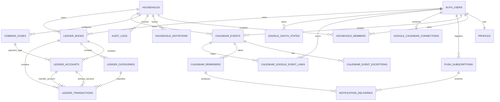
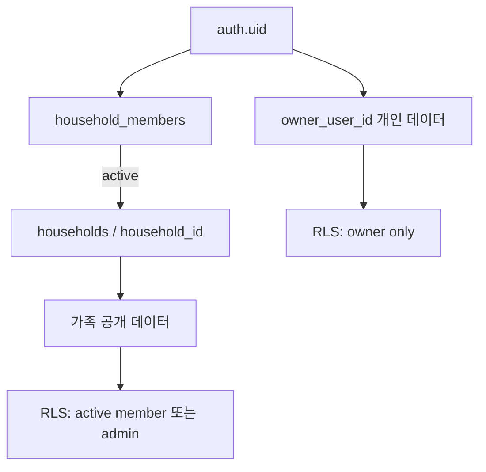
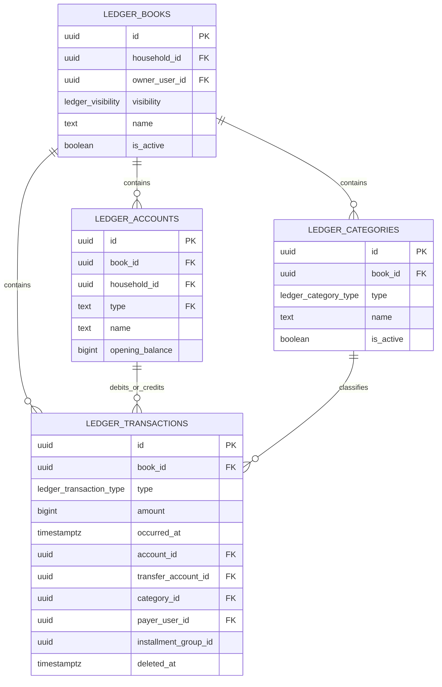

# 우리집 웹사이트 ERD

> 기준 migration: `20260827060000_add_calendar_choice_codes.sql`까지

## 전체 관계도

`auth.users`는 Supabase Auth가 관리하므로 public migration에서 생성하지 않는다. 그림의 `AUTH_USERS`는 외부 인증 엔티티를 뜻한다.

## 보안 경계

- 거의 모든 업무 데이터는 `household_id`로 1차 격리한다.
- 일정과 장부의 `private` 데이터는 `owner_user_id`로 2차 격리한다.
- 관리자 권한도 다른 사용자의 개인 일정·개인 장부를 우회하지 못한다.
- Google refresh token과 OAuth state는 브라우저 역할에 컬럼 권한을 주지 않는다.

## 핵심 엔티티 필드

### 계정·가족

| 테이블                  | PK        | 주요 FK            | 핵심 필드/제약                                                             |
| ----------------------- | --------- | ------------------ | -------------------------------------------------------------------------- |
| `profiles`              | `user_id` | auth.users         | `timezone`, 본인만 조회/수정                                               |
| `households`            | `id`      | `created_by`       | 가족 공간 이름, 최상위 공유 경계                                           |
| `household_members`     | `id`      | household, user    | `display_name`, `role`, `status`; 사용자는 활성/정지 가족 공간 하나만 가능 |
| `household_invitations` | `id`      | household, creator | 이메일, token hash, 상태, 7일 만료; 원문 토큰 미저장                       |
| `audit_logs`            | `id`      | household, actor   | 구성원/초대 보안 이벤트, 민감정보 metadata 금지                            |
| `common_codes`          | `id`      | household, creator | `(household_id, group_key, code)` unique, 라벨·정렬·활성·잠금 여부         |

### 일정·알림·Google

| 테이블                        | PK           | 주요 FK                 | 핵심 필드/제약                                                           |
| ----------------------------- | ------------ | ----------------------- | ------------------------------------------------------------------------ |
| `calendar_events`             | `id`         | household, owner        | 공개범위, 기간, 종일, 색상, 반복 주기/종료                               |
| `calendar_event_exceptions`   | `id`         | event, household, owner | 반복 일정 한 회차 취소/덮어쓰기; `(event_id, original_starts_at)` unique |
| `calendar_reminders`          | `id`         | household, owner, event | 일정 사전 알림 또는 요일·시간 반복 알림 중 하나                          |
| `push_subscriptions`          | `id`         | user                    | 브라우저 Web Push endpoint와 공개키, 기기별 활성 상태                    |
| `notification_deliveries`     | `id`         | reminder, subscription  | 예약시각, 전송상태; 동일 예약 중복 방지                                  |
| `google_calendar_connections` | `user_id`    | household               | Google 계정·캘린더, 암호화 refresh token, 연결상태                       |
| `google_oauth_states`         | `state_hash` | user, household         | 일회성 OAuth CSRF 상태와 만료/소비시각                                   |
| `calendar_google_event_links` | `id`         | event, user             | 로컬 event와 Google event ID의 사용자별 매핑                             |

### 가계부

| 테이블                | PK   | 주요 FK                             | 핵심 필드/제약                                                             |
| --------------------- | ---- | ----------------------------------- | -------------------------------------------------------------------------- |
| `ledger_books`        | `id` | household, owner                    | `family/private`, KRW, 활성 상태; 가족 1개·사용자별 개인 1개               |
| `ledger_accounts`     | `id` | book, household, owner, common code | 결제수단 이름·유형·시작잔액·활성 상태                                      |
| `ledger_categories`   | `id` | book, household, creator            | 수입/지출 분류, 이름·아이콘·색상·정렬                                      |
| `ledger_transactions` | `id` | book, accounts, category, users     | 정수 금액, 일자, 수입/지출/이체, 결제자·작성자, soft delete, 할부 metadata |

## 가계부 상세 관계

수입은 `account_id` 잔액을 증가시키고, 지출은 감소시킨다. 이체는 `account_id`를 감소시키고 `transfer_account_id`를 증가시키며 월 수입·지출 합계에서는 제외한다.

## 주요 카디널리티와 삭제 정책

| 관계                                       | 카디널리티 | 삭제 정책/의미                                     |
| ------------------------------------------ | ---------- | -------------------------------------------------- |
| household → member                         | 1:N        | 구성원은 삭제 대신 `removed` 상태 보존             |
| household → calendar event                 | 1:N        | household 삭제 시 cascade                          |
| event → exception/link/reminder            | 1:N        | event 삭제 시 cascade                              |
| ledger book → account/category/transaction | 1:N        | book 삭제 시 cascade; 앱은 비활성/soft delete 우선 |
| transaction → account/category             | N:1        | 거래가 있으면 참조 대상 물리 삭제 제한             |
| reminder → delivery                        | 1:N        | reminder 삭제 시 전송 이력 cascade                 |
