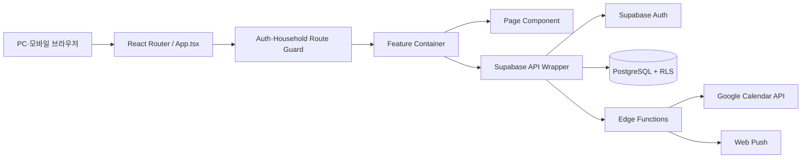

# 우리집 웹사이트 코드 구성 설명서

> 기준일: 2026-08-28 · 대상: 현재 `main` 작업 트리의 Auth, Household, App Shell, Calendar, Ledger, Common Codes

## 1. 전체 실행 흐름



사용자 입력은 `Page`가 받고, 비동기 처리와 화면 상태는 `Container`가 관리한다. DB 접근은 기능별 API wrapper가 담당하며, 최종 권한 검사는 PostgreSQL RLS와 trigger가 다시 수행한다.

## 2. 저장소 구조

```text
HomeWebSite/
├─ apps/web/                    React + TypeScript + Vite 웹 앱
│  └─ src/
│     ├─ App.tsx                전체 URL과 접근 가드 연결
│     ├─ config/                공개 환경변수 검증
│     ├─ lib/supabase/          브라우저용 Supabase client
│     └─ features/              기능 단위 UI·상태·API
├─ packages/shared/             프런트 공용 타입·검증·금액/날짜 유틸
├─ packages/design-system/      재사용 UI 기반 패키지
├─ packages/statement-parser/   향후 금융 명세 파싱 패키지
├─ services/                    향후 Python FastAPI 분석 서비스 위치
├─ supabase/migrations/         DB 스키마·RLS·RPC 변경 이력
├─ supabase/functions/          Google 연동·초대·알림 서버 함수
├─ supabase/tests/              RLS·DB 함수 보안 테스트
└─ docs/                        계획·설계·분석·아키텍처 문서
```

## 3. 코드를 읽는 권장 순서

1. [`apps/web/src/App.tsx`](../../apps/web/src/App.tsx): URL과 인증/가족 접근 가드를 확인한다.
2. [`apps/web/src/features/app-shell/app-navigation.ts`](../../apps/web/src/features/app-shell/app-navigation.ts): 사용자 역할별 메뉴 구성을 본다.
3. 관심 기능의 `*Container.tsx`: 어떤 데이터를 조회하고 저장하는지 확인한다.
4. 같은 기능의 `api/*-api.ts`: Supabase table/RPC 호출을 확인한다.
5. 같은 기능의 `*Page.tsx`: 실제 화면과 사용자 입력 흐름을 확인한다.
6. [`packages/shared/src`](../../packages/shared/src): DB 응답을 표현하는 타입과 공용 검증 규칙을 본다.
7. [`supabase/migrations`](../../supabase/migrations): 최종 데이터 제약과 RLS를 확인한다.

프런트 코드만 보고 권한을 판단하면 안 된다. 화면에서 버튼을 숨기는 것은 편의 기능이고, 실제 보안 경계는 migration의 RLS와 DB trigger다.

## 4. 기능별 코드 지도

| 기능        | 진입 화면                          | 상태/조정                  | DB 접근                                   | 공용 도메인             |
| ----------- | ---------------------------------- | -------------------------- | ----------------------------------------- | ----------------------- |
| 인증        | `features/auth/auth.tsx`           | 같은 파일의 Provider/Guard | Supabase Auth와 access RPC                | `shared/household.ts`   |
| 가족 관리   | `household/pages/*`                | `Household*Container.tsx`  | `household/api/household-api.ts`          | `shared/household.ts`   |
| 앱 메뉴     | `app-shell/AppShell.tsx`           | AppShell 내부              | 없음                                      | `app-navigation.ts`     |
| 일정        | `calendar/CalendarPage.tsx`        | `CalendarContainer.tsx`    | `calendar/api/*`                          | `shared/calendar.ts`    |
| 알림        | `calendar/NotificationPanel.tsx`   | CalendarContainer/Panel    | `notification-api.ts`                     | calendar migration      |
| Google 연동 | CalendarPage                       | CalendarContainer          | `google-calendar-api.ts` + Edge Functions | calendar sync migration |
| 가계부      | `ledger/LedgerPage.tsx`            | `LedgerContainer.tsx`      | `ledger/api/ledger-api.ts`                | `shared/ledger.ts`      |
| 공통코드    | `common-codes/CommonCodesPage.tsx` | 페이지 내부                | `common_codes` Data API                   | `LedgerCommonCode`      |

## 5. 주요 요청 흐름

### 로그인과 가족 공간 진입

```text
Supabase 세션 확인
→ get_my_access_context() RPC
→ active / invited / suspended / removed / unassigned 판정
→ HouseholdRoute가 /app 접근 허용 또는 상태 화면으로 이동
```

계정 ID는 Supabase Auth의 이메일이다. `profiles`는 시간대 등 앱 설정만 보관하고, 가족 내 표시 이름과 역할은 `household_members`에 둔다.

### 일정 저장

```text
CalendarPage 입력
→ CalendarContainer.save()
→ calendar-api create/update
→ calendar_events RLS 및 trigger
→ 다시 조회
→ calendar-dates가 반복 일정을 화면 occurrence로 확장
```

반복 일정 중 한 회차만 취소/변경하면 원본을 수정하지 않고 `calendar_event_exceptions`에 예외를 저장한다. Google 캘린더 전송은 `calendar_google_event_links`로 로컬 일정과 Google event를 매핑한다.

### 가계부 거래 저장

```text
LedgerPage 입력
→ shared 금액/날짜/거래 shape 검증
→ LedgerContainer mutation
→ ledger-api 또는 create_ledger_installment() RPC
→ DB trigger가 book/account/category/household 일치 재검증
→ 월 거래·요약 재조회
```

금액은 `number`가 아니라 DB `bigint`와 TypeScript 정수 문자열/`BigInt`로 계산한다. 거래 입력일은 Asia/Seoul 00:00을 UTC로 변환해 저장한다.

### 공통코드

`common_codes`는 가족 공간별 중앙 코드 저장소다. 결제수단 유형은 관리자가 확장할 수 있다. 역할, 상태, 거래유형처럼 권한·계산에 영향을 주는 그룹은 목록과 라벨을 중앙화하되 `is_admin_editable=false`로 잠근다.

## 6. 가족 장부와 개인 장부

| 구분      | DB 값                | 조회자                 | 생성 제한                         |
| --------- | -------------------- | ---------------------- | --------------------------------- |
| 가족 장부 | `visibility=family`  | 활성 가족 구성원       | 가족 공간당 활성 1개, 관리자 생성 |
| 개인 장부 | `visibility=private` | `owner_user_id` 본인만 | 사용자·가족 공간당 활성 1개       |

개인 장부는 가족 관리자도 읽을 수 없다. 이 규칙은 UI가 아니라 `private.can_read_ledger_book()`과 하위 테이블 RLS에서 적용된다.

## 7. DB 변경 방법

- 이미 적용된 migration은 수정하지 않는다.
- `supabase/migrations/<timestamp>_<description>.sql`을 새로 추가한다.
- 모든 공개 업무 테이블에 RLS를 적용한다.
- `household_id`가 부모 엔티티와 일치하도록 FK와 trigger를 함께 둔다.
- DB 변경 후 `supabase/tests`의 RLS 테스트와 `pnpm check`를 실행한다.

## 8. 현재 구현 범위와 다음 확장점

구현됨: 이메일 인증, 가족 초대/구성원 관리, 반응형 App Shell, 일정·반복·예외·알림·Google 전송, 가족/개인 가계부, 달력형 거래 조회, 할부, 중앙 공통코드.

후속 예정: 은행 명세 업로드/중복 검출, 자동 분류, 예산, 가계부 대시보드·비용 제안, 디데이, 목표 관리, 운영 배포와 모니터링.
